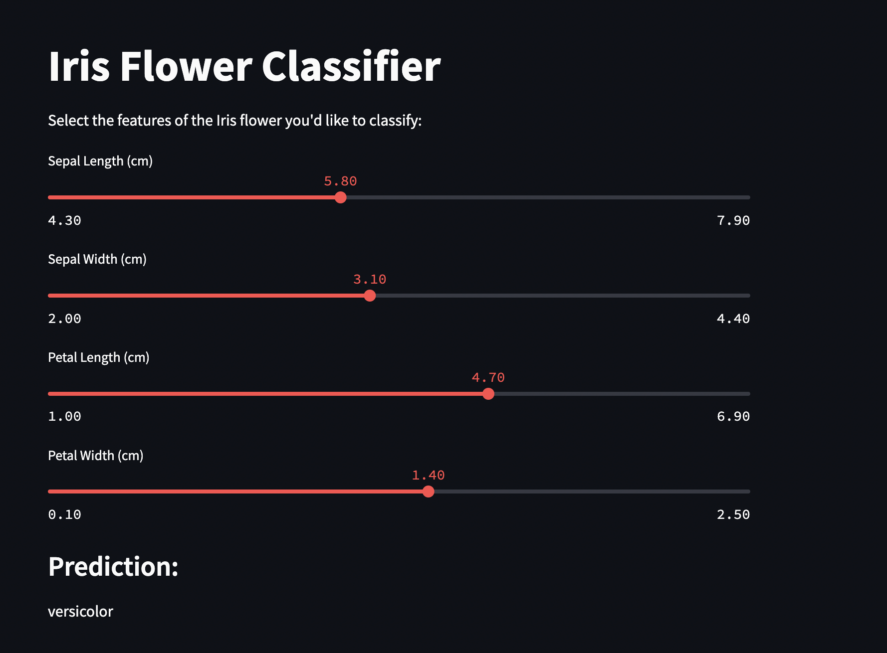

# streamlit_app_nn

## Background

This project aims to train a Neural Network in Google Colab, pickle the trained model, and deploy it to Streamlit Cloud.

### Dataset

We have used Iris dataset to train the neural network.

### Application

### Link to the app

https://aasd4015group17miniproject.streamlit.app/